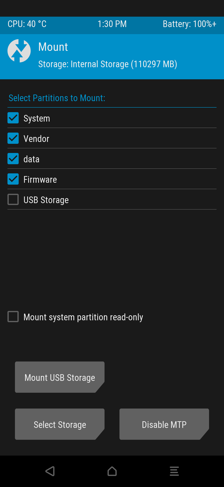
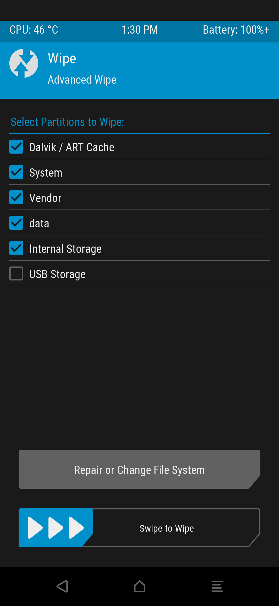
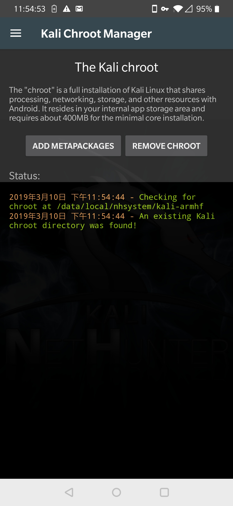

# Installation of extract_android_ota_payload dependency

**For Linux system use the following command:**

```
apt install python
apt install python-protobuf
```
**For Windows system or any other system with Python installed and configured:**

```
pip install protobuf
```

# adb and fastboot downloading

**For Linux users you can just use apt (or any other package manager)**

```
apt install adb
atp install fastboot
```

**For the rest please download the tools from Google official site**

* **[Windows](https://dl.google.com/android/repository/platform-tools-latest-windows.zip)**


* **[Mac](https://dl.google.com/android/repository/platform-tools-latest-darwin.zip)**

* **[Linux...](https://dl.google.com/android/repository/platform-tools-latest-linux.zip)**


# Downloading ROM

* **Download Oxygen OS from the following official site**

* **Personally I would recommend Beta Build, for it always have the latest feature, and the kernel developing and debugging is based on OOs. But theoretically, the kernel supports H2Os, so it's up to you to decide which one to use.**


* **[Oxygen OS 6T](https://www.oneplus.com/support/softwareupgrade/details?code=9)**

* **[Oxygen OS 6](https://www.oneplus.com/support/softwareupgrade/details?code=8)**


* **Then unzip the ROM you just downloaded to extract the payload.bin file, and use the following command to extract the Os image:**


```
python extract_android_ota_payload.py payload.bin out
```

* **After that you'll be able to see all the image in the /out directory. Then copy the .bat or .sh script (depending on the system you're running) into the folder. Choose the recovery.img of TWRP which suits your phone (OnePlus 6/OnePlus 6T) and copy it into the /out folder. The script shuaji.sh/shuaji.bat uses twrp-3.3.1-0-fajita-O6T.img as default, please modify as needed.**


# Other options

* **To ensure the kernel is flashed in clean and safely, you can CHOOSE to perform the following steps to flash in a pure Oxygen Os:**

**Flash in the TWRP, then mount every sectors in the TWRP. Choose wipe, select them all, the swipe right to confirm the wipe operation.**

```
fastboot boot twrp(OP6 or OP6T)recovery.img
```






**After the wipe tap "Restart to system", the phone will automatically boot into bootloader. Then proceed to flash in a new Os:**

```
Windows: double click the flash.bat in the /out folder
Linux: bash flash.sh when in /out folder
```

**After the flashing operation, install magisk.zip, then boot into system to confirm the successful installation of Magisk. Choose one of the following method to perform the installation:**

```
1、 
tap sideload

then perform adb sideload magisk-xxx-xxx.zip on the computer to flash in magisk

reboot to system to confirm the installation.

2、
adb push magisk-xxx-xxx.zip /sdcard

then go to sdcard to install magisk-xxx-xxx.zip

reboot to system to confirm the installation.

```

**!!!If you're currently in China while performing the methods above, please DO NOT CONNECT TO WIFI AND REMOVE THE SIM CARD the first time you boot into system. The oxygen Os will verify the Google information, and apparently you can't visit Google in China, so it will be stuck in the verification screen. DO REMEMBER THIS!!!**


* **Then use the following command to flash in the kernel (choose one from the two methods)**

```
Turn on USB debug mode and run shuaji.sh or shuaji.bat

1、 
tap sideload

then use adb sideload DJY-Kernel-VXX.zip on the computer to flash in the kernel

reboot to system to confirm the installation.

2、
adb push DJY-Kernel-VXX.zip /sdcard

then go to sdcard and install DJY-Kernel-VXX.zip

reboot to system to confirm the installation.

```

# Kali Chroot Install


* **
* **!Linux Deploy install as directory**


* **Linux Deploy install as RootFS**


***
* **Default installation with Kali Nethunter APP**

